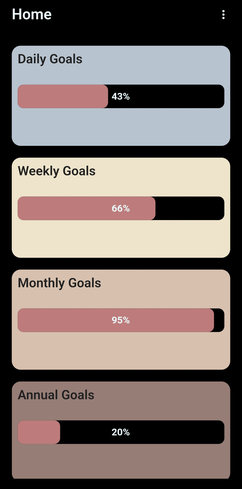
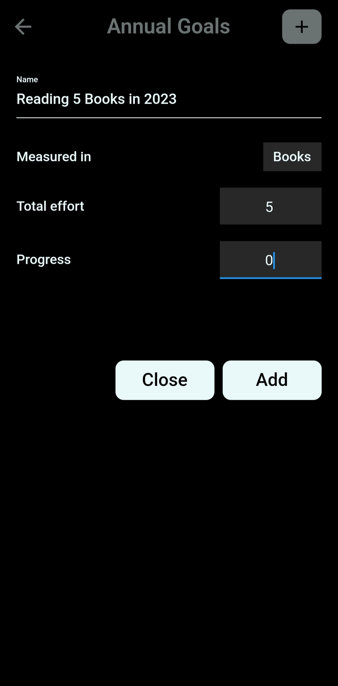
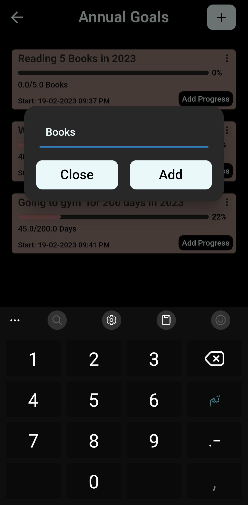
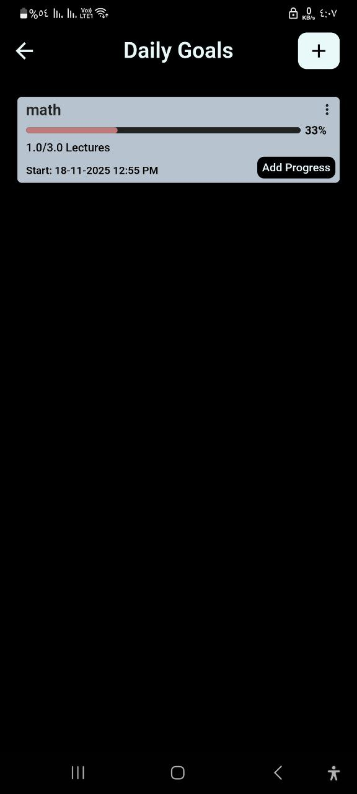
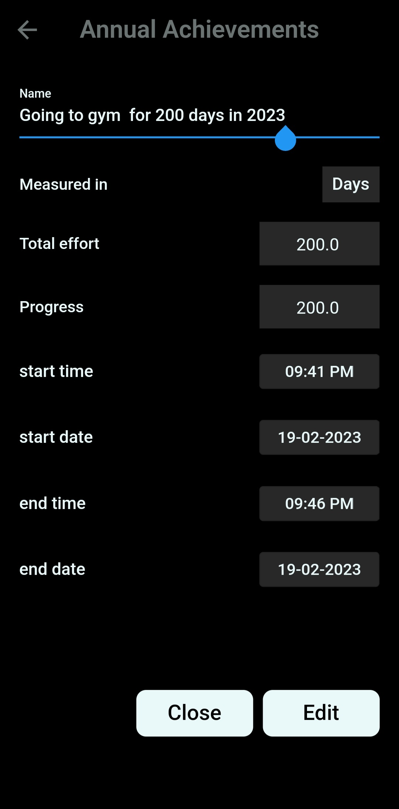
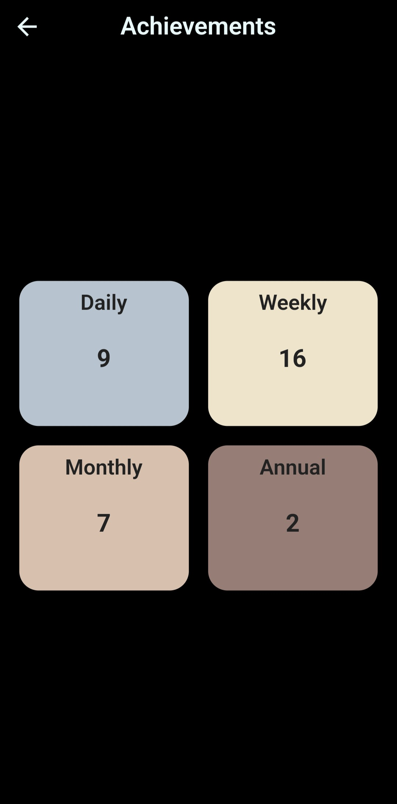
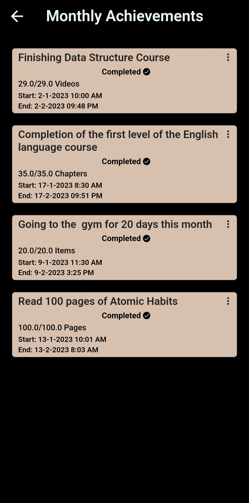

# 🎯 Track Your Goals & Habits

A comprehensive goal tracking mobile application built with Flutter, designed to help users manage and achieve their goals across different time frames.

## 📱 About The Project

Track Your Goals & Habits is a mobile application that enables users to set, track, and achieve their goals across four different timeframes: Daily, Weekly, Monthly, and Annual goals.

### 🎥 App Screenshots

  
  
  
  
  
  
  

## ✨ Key Features

- 📊 **Multi-Timeframe Goals**: Daily, Weekly, Monthly, and Annual goal tracking
- 📈 **Visual Progress Tracking**: Real-time progress bars with percentage completion
- 🏆 **Achievement System**: Track completed goals and milestones
- 📝 **Flexible Goal Units**: Support for various measurement units (Books, Days, Pages, etc.)
- 💾 **Offline-First**: All data stored locally with SQLite
- 🎨 **Clean UI**: Material Design with smooth animations
- ⚡ **Fast Performance**: Optimized with efficient state management

## 🛠️ Built With

- **Framework**: Flutter & Dart
- **State Management**: Bloc Pattern (flutter_bloc)
- **Local Database**: SQLite (sqflite)
- **UI**: Material Design Components

## 🏗️ Technical Implementation

### Core Technologies
- `flutter_bloc` - State management
- `sqflite` - Local database
- Custom widgets for reusable UI components
- Responsive design for multiple screen sizes

### Key Technical Features
- CRUD operations with SQLite
- Date-based calculations for goal tracking
- Progress percentage algorithms
- Achievement completion detection
- Data persistence across app sessions

## 📊 App Flow

1. **Home Screen**: Overview of all goal categories with progress
2. **Goal Management**: Add/Edit goals with custom parameters
3. **Progress Tracking**: Update progress incrementally
4. **Achievements**: View completed goals history

## 🎯 Use Cases

- Personal habit tracking (gym, reading, learning)
- Professional goal management
- Educational progress monitoring
- Health and wellness tracking

## 📥 Installation

Download the app from Google Play Store:

## 👨‍💻 Developer
**[اسمك]**
- GitHub: [@IsaacGerges](https://github.com/IsaacGerges)
- LinkedIn: [IsaacGerges]([https://linkedin.com/in/yourprofile](https://www.linkedin.com/in/isaac-gerges-14405022b/))

## 📄 License

This is a proprietary project. The source code is private.

## 📞 Contact

For business inquiries or collaboration: isaacgerges2003@gmail.com

---

⭐ If you like this project, please give it a star on Google Play!
